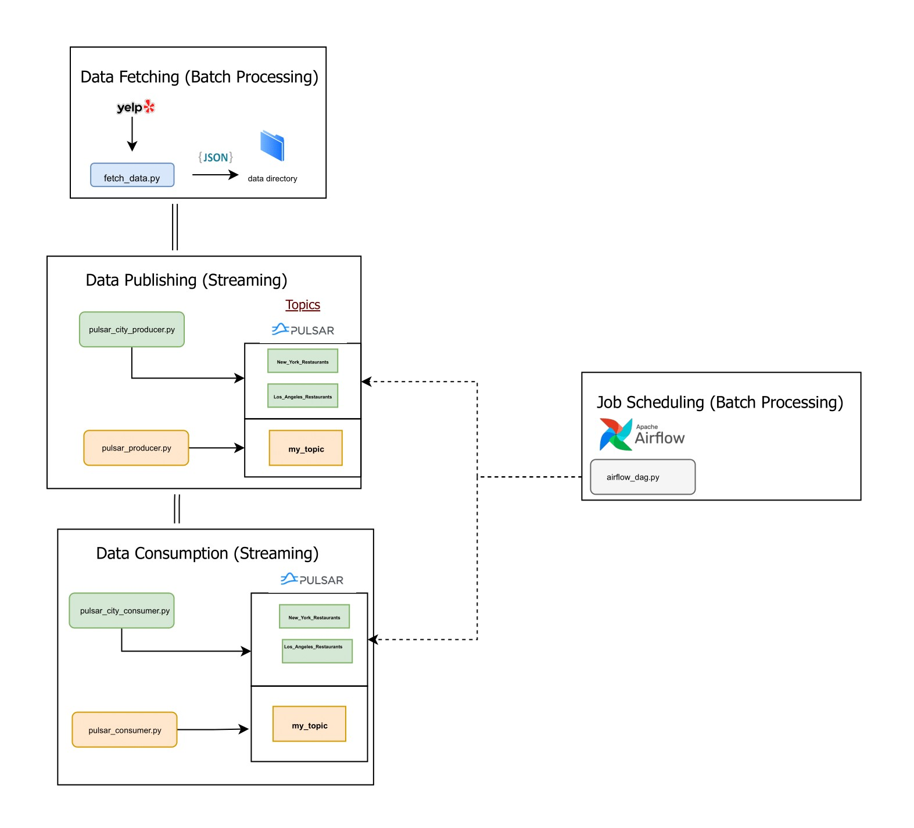

# Apache Pulsar Data Pipeline Project

This repo contains Python scripts for a project that retrieves restaurant/business data using the Yelp API and then routes it using an Apache Pulsar pipeline that uses producers and consumers. To schedule the jobs, the project also uses an Apache Airflow Directed Acyclic Graph (DAG).

## Getting Started:

### Prerequisites
- Python 3.x
- Apache Pulsar
- Apache Airflow
- Docker

## Files in this repository
- **fetch_data.py**: This script fetches restaurant data for both New York and Los Angeles, making multiple requests per city to fetch more than just the first 50 results.
- **pulsar_city_producer.py**: This script includes a function to publish Yelp data to Pulsar. It loops over all JSON files in a city's data, sending the data to a Pulsar topic. It goes through both cities defined in the list, pulling data from both.
- **pulsar_city_consumer.py**: This script includes a function to create and run a consumer for a given city's Pulsar topic, receiving and processing messages from that topic. It consumes both cities defined in the list.
- **airflow_dag.py**: This script defines an Apache Airflow DAG, which manages the running of producer and consumer tasks for a list of cities.
- **pulsar_producer.py**: This loads only a single JSON file ('New York_350.json' used) into a Python dictionary and sends this data to the topic. The script pauses for 1 second before closing the producer and client. It's meant to load only one file to the topic.
- **pulsar_consumer.py**: This script continuously receives and processes messages, printing out each business from the data. Messages are acknowledged upon successful processing, but they are negatively acknowledged if not processed. The consumer runs indefinitely until manually stopped.

